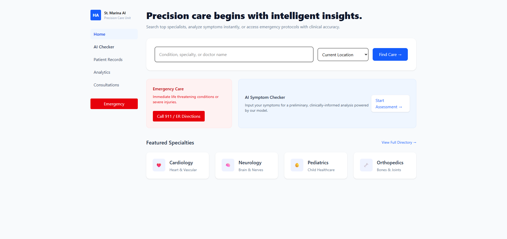

# hospital-finder

Precision care begins with intelligent insights — a compact full-stack prototype that helps users search hospitals, check symptoms with an AI-assisted model, and find appropriate specialties.



**Project Overview**

This repository is a demo application combining a React + Vite frontend with a Python backend that serves a symptom-to-specialty classifier and a hospital directory. It showcases how small, focused ML + heuristic systems can be integrated into a user-facing web app.

**Highlights**
- **Frontend:** React (v19) + Vite, styled with Tailwind CSS, uses Firebase for optional persistence and React Router for navigation.
- **Backend:** FastAPI + Uvicorn, Python data processing with pandas, and a lightweight text classifier using scikit-learn.
- **Data:** Hospital directory (CSV) and a symptom→specialty mapping (CSV). The hospital data is sourced from official open datasets (data.gov.in) and processed; the symptom mapping was compiled from public sources and manually augmented for coverage and clarity.

**Key Features**
- Search hospitals by name, location, specialty, or facilities.
- AI-assisted symptom checker endpoint that returns a recommended specialty.
- CSV-to-JSON conversion utilities for preparing frontend data.

**Data Sources & Preparation**
- Hospital directory: derived from the Indian open data portal (data.gov.in). The raw CSV is available at `backend/hospital_directory.csv` and is preprocessed with `backend/csv_to_json.py` (filters, cleans specialties, derives contact info, and exports `hospital-data.json`).
- Symptom dataset: stored at `backend/data/symptoms.csv`. The dataset was compiled from public references and manually augmented to improve model coverage and to provide clearer examples for each specialty.

**AI / Model Training & Techniques**
- Training script: `backend/train.py`.
- Text preprocessing: normalization (lowercasing, punctuation removal, whitespace collapsing) implemented in `backend/symptom_matcher.py`.
- Feature extraction: TF–IDF vectorization using `sklearn.feature_extraction.text.TfidfVectorizer`.
- Classification algorithm: Multinomial Naive Bayes (`sklearn.naive_bayes.MultinomialNB`).
- Model composition: an `sklearn.pipeline.Pipeline` that chains TF–IDF and the classifier for simple, reproducible training and inference.
- Deterministic fallback / keyword matching: `backend/symptom_matcher.py` implements a rule-based keyword matcher that performs longest-match scoring and boosts exact matches — used as a first-pass before the ML model for high-confidence keyword hits.
- Model persistence: `joblib` is used to save/load the trained pipeline to `backend/models/specialty_model.pkl`.

Notes on methodology: the system intentionally combines lightweight, interpretable heuristics (keyword matching) with a compact statistical model (TF–IDF + Naive Bayes). This hybrid approach reduces incorrect predictions for clearly stated symptoms and improves robustness where surface-level keywords are present.

**Technologies & Dependencies**
- Backend: `Python 3`, `FastAPI`, `uvicorn`, `pandas`, `numpy`, `scikit-learn`, `joblib`.
- Frontend: `React`, `Vite`, `Tailwind CSS`, `Firebase`, `react-router-dom`.
- Tooling: `Node.js` / `npm`, `ESLint` for linting.

See `frontend/package.json` and `backend/requirements.txt` for exact dependency versions.

**How it works (request flow)**
1. Frontend sends a `POST /predict` request with a free-text `symptoms` string.
2. Backend first runs the deterministic keyword matcher (`backend/symptom_matcher.py`). If a strong keyword match exists, that result is returned immediately.
3. If no keyword match is found, the saved ML pipeline (`models/specialty_model.pkl`) is used to predict the most likely specialty from the symptom text.

**Quick Start**

- Clone the repo:

```
git clone https://github.com/Sattwik2003/hospital-finder.git
cd hospital-finder
```

- Backend (Python):

```
py -3 -m venv .venv
.\\.venv\\Scripts\\Activate.ps1   # PowerShell
pip install -r backend/requirements.txt
python backend/main.py
```

- Frontend (Node / Vite):

```
cd frontend
npm install
npm run dev
```

**Important files**
- `backend/train.py` — training pipeline (TF–IDF + MultinomialNB).
- `backend/symptom_matcher.py` — normalization + deterministic keyword matcher.
- `backend/csv_to_json.py` — converts and cleans `backend/hospital_directory.csv` → `frontend/hospital-data.json`.
- `backend/data/symptoms.csv` — symptom → specialty examples (manually curated + augmented).
- `backend/models/specialty_model.pkl` — serialized trained pipeline used in production.

**Contributing & Extensions**
- Improve the symptom dataset with sourced citations and a held-out evaluation set for objective metrics.
- Replace the classifier with a more expressive model (e.g., logistic regression, small transformer) if higher accuracy is required — be mindful of inference cost.
- Integrate secure hospital data updates and authentication for data uploads.


